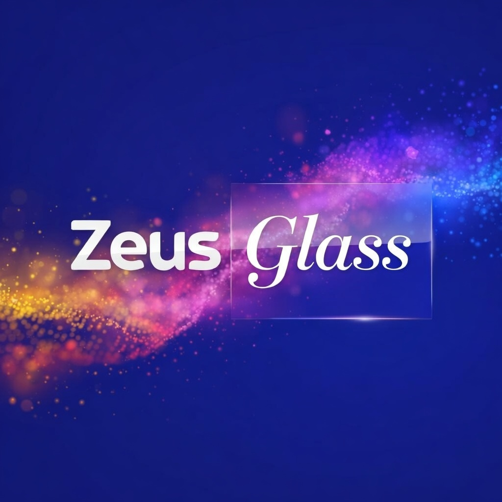

# Zeus Glass

<div align="center">
  


### Premium IPTV & Streaming Platform for Android TV & Fire TV

*Sky Glass Inspired UI | Real-Debrid Integration | Live TV & VOD | Picture-in-Picture*

[](https://github.com/Zeus768/zeus-glass)
[](https://opensource.org/licenses/MIT)
[](https://expo.dev/)
[](https://reactnative.dev/)

[Features](#features) | [Screenshots](#screenshots) | [Installation](#installation) | [Building APK](#building-apk)

</div>

---

## Features

### Sky Glass Inspired UI
- Beautiful hero carousel with featured content
- Top navigation tabs optimized for TV remote (D-pad)
- Dark glassmorphic theme with cyan accents
- Highly visible focus states for TV navigation
- Professional gradient overlays

### Content Discovery
- **Movies** - Browse by genre, trending, popular, in cinemas
- **TV Shows** - Complete library with episode tracking
- **Universal Search** - Search across all content including IPTV VOD
- **Favorites** - Save your favorite movies and shows
- **Continue Watching** - Pick up where you left off (via Trakt)
- **Ended/Cancelled Badges** - See show status at a glance

### Live TV & IPTV
- **TV Guide** - Electronic Program Guide (EPG) with time slots
- **Live Channels** - Category filtering (Entertainment, Sports, News, etc.)
- **VOD Content** - Video On Demand from your IPTV provider
- **Xtreme Codes Support** - Compatible with most IPTV providers
- **Picture-in-Picture** - Watch live TV while browsing the guide
- **Parental Controls** - PIN-protected adult content

### Streaming & Debrid
- **Real-Debrid Integration** - Device code authentication via QR
- **AllDebrid & Premiumize** - Alternative debrid services
- **Torrentio** - Multi-source torrent scraper
- **18+ Scrapers** - VidSrc, SuperEmbed, SmashyStream, and more
- **Quality Selection** - Filter by 4K, 1080p, 720p
- **Cached Torrents** - Instant playback with debrid services

### Player Features
- **Player Choice Dialog** - Select Internal, VLC, MX Player, or external
- **True Fullscreen** - Native fullscreen on Android TV/Fire TV
- **Zeus Player** - Built-in player with subtitle support
- **Resume Playback** - Continue from where you stopped

### Settings & Backup
- **Zeus Vault** - Backup and restore all account settings
- **QR Code Auth** - Easy login on TV devices
- **Account Management** - View expiry dates, connection status
- **Trakt Integration** - Sync watch history across devices

### Platform Support
- Android TV
- Fire TV / Fire Stick
- Nvidia Shield
- Android Mobile (Phones & Tablets)
- iOS (iPhone & iPad)
- Web (Preview only)

---

## Screenshots

| Home Screen | TV Guide | Movie Detail |
|-------------|----------|--------------|
| Hero carousel with trending content | EPG with categories and PiP | Stream sources and quality selection |

| Settings | Live TV | Search |
|----------|---------|--------|
| Account management and Zeus Vault | Category drill-down view | Universal search with results |

---

## Installation

### Prerequisites
- Node.js 18+ and yarn
- Expo CLI (`npm install -g expo-cli`)
- Python 3.10+ (for backend)

### Quick Start

```bash
# Clone the repository
git clone https://github.com/Zeus768/zeus-glass.git
cd zeus-glass

# Install frontend dependencies
cd frontend
yarn install

# Install backend dependencies
cd ../backend
pip install -r requirements.txt

# Start the backend server
python server.py

# In another terminal, start the frontend
cd ../frontend
yarn start
```

---

## Building APK

### For Android TV / Fire TV

```bash
cd frontend

# Install EAS CLI
npm install -g eas-cli

# Login to Expo account
eas login

# Configure build
eas build:configure

# Build APK (for sideloading)
eas build -p android --profile preview

# Or build AAB for Google Play
eas build -p android --profile production
```

### Local Build (No Expo Account)

```bash
cd frontend

# Generate native project
npx expo prebuild

# Build debug APK
cd android
./gradlew assembleDebug

# APK will be at: android/app/build/outputs/apk/debug/
```

---

## Configuration

### Required Setup
1. **IPTV Credentials** - Your Xtreme Codes provider details
2. **Real-Debrid** - Free or premium account (QR code login)
3. **Trakt** - Optional for watch history sync

### Environment Variables (Backend)
```env
MONGO_URL=your_mongodb_connection_string
```

### Environment Variables (Frontend)
```env
REACT_APP_BACKEND_URL=your_backend_url
```

---

## Architecture

### Frontend
- **Framework**: Expo 54 + React Native
- **Language**: TypeScript
- **Navigation**: Expo Router (file-based)
- **State**: Zustand
- **UI**: Custom components (Sky Glass inspired)
- **Video**: expo-av / expo-video

### Backend
- **Framework**: FastAPI (Python)
- **APIs**: TMDB, Trakt, Torrentio, Real-Debrid, AllDebrid, Premiumize

---

## Version History

### v1.5.0 (Current)
- TV UI size reduction (~50%) for better fit on Shield/Fire TV
- Picture-in-Picture (PiP) for IPTV
- Sources search dialog with real-time progress
- New app icon
- Scene release site scrapers (DDLValley, ScnSrc, RLSBB)

### v1.4.0
- Player choice dialog (Internal/VLC/MX Player)
- IPTV category drill-down view
- Trakt "Next Up" episode feature
- "Ended/Cancelled" badges on TV shows

### v1.3.0
- Zeus Vault backup/restore
- Parental controls with PIN
- Enhanced TV navigation

---

## License

This project is licensed under the MIT License.

---

## Disclaimer

This application is for educational purposes. Users are responsible for:
- Complying with their local laws
- Respecting content copyright
- Using legitimate streaming services
- Obtaining proper licenses for IPTV services

Zeus Glass does not host, store, or distribute any copyrighted content.

---

<div align="center">

**Made with love by Zeus768**

Star this repo if you found it helpful!

</div>
